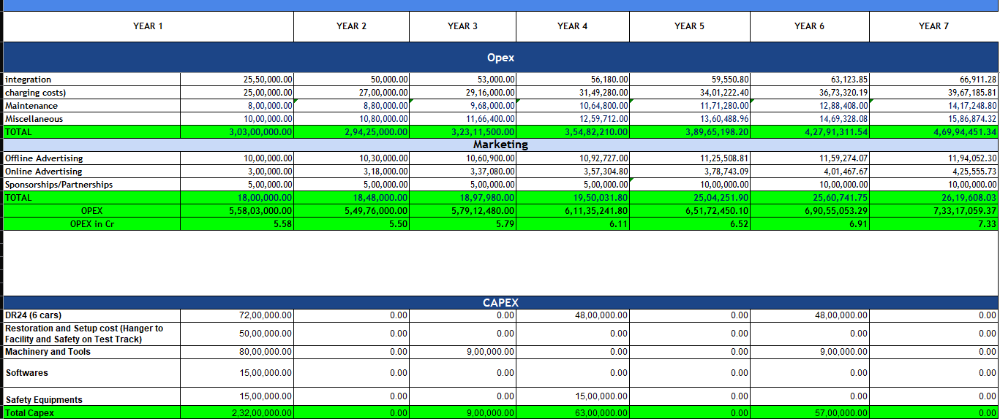
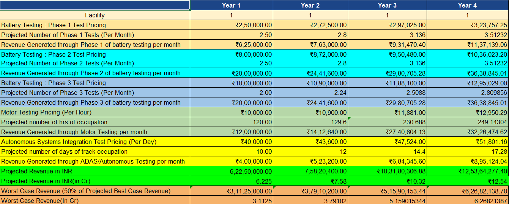
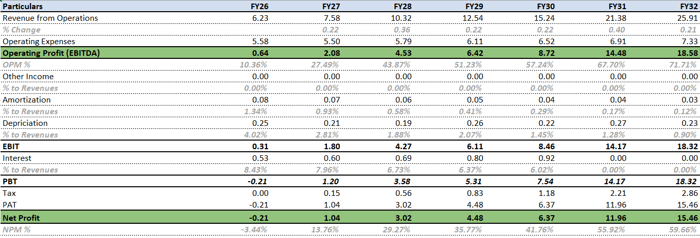
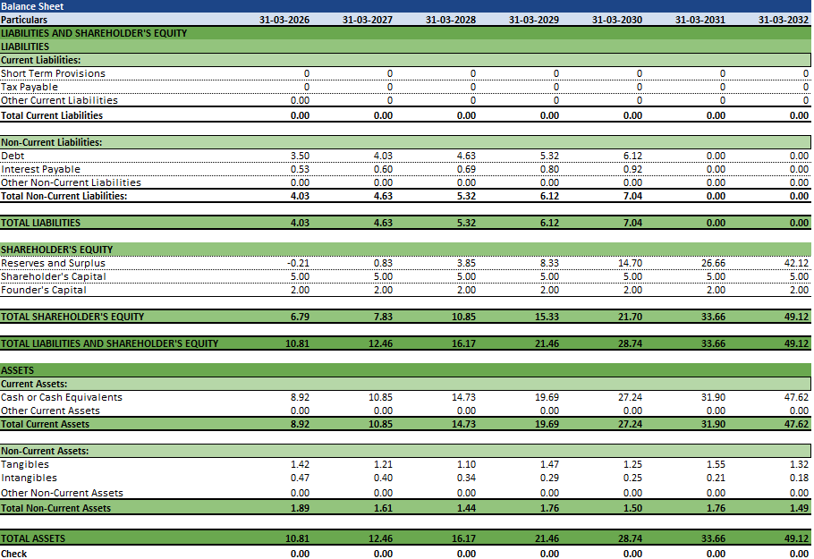
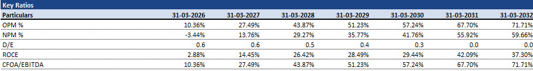
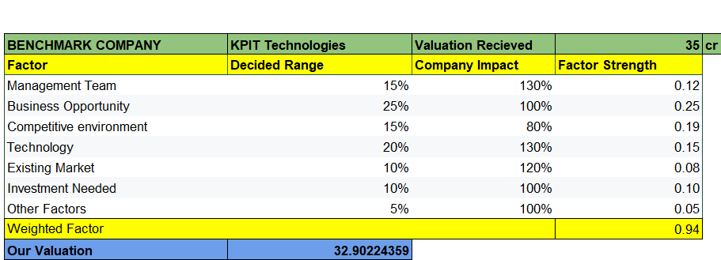
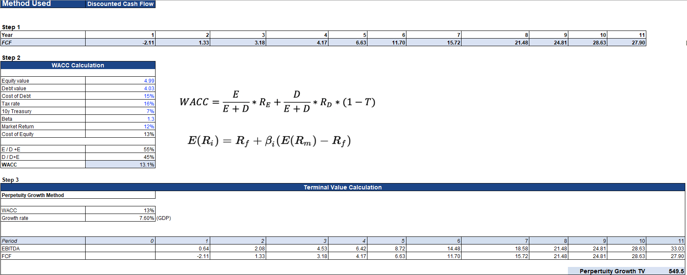

# 📊 EV Startup Financial Model & Valuation (Excel)

This repository contains a comprehensive **startup financial model and valuation toolkit** built entirely from scratch in Microsoft Excel. It was developed for a hypothetical EV-focused startup as part of a business plan presentation competition, where it was used to simulate real-world financial performance, assess investor viability, and project future growth.

---

## 🚀 Overview

The project models the financial trajectory of an early-stage, capital-intensive startup and covers everything from **budget planning and financial statement creation** to **valuation and scenario analysis**. All assumptions are grounded in realistic market research, with a focus on simulating investor-grade financial documents and insights.

---

## 🧠 Key Elements of the Project

### 1. 📌 Realistic Market-Based Assumptions
- Researched and incorporated real-world data to define the startup’s **cost structure, growth expectations, operational expenses, and team planning**.
- Defined key drivers like:
  - Capital expenditure (CAPEX): machinery, infrastructure, and testing equipment.
  - Operating expenses (OPEX): salaries, R&D, marketing, admin, and logistics.
  - Hiring plans and salary progression.  

---

### 2. 🧾 Per Annum Budget Allocation
- Created a dynamic **7-year budget sheet** to allocate funding for all major operational heads.
- Distinct classification between **fixed and variable costs**, and annual escalation modeled based on business growth.
- Structured to reflect funding needs and cost absorption over time.

  ---

### 3. 📊 Revenue Forecasting
- Built a **multi-stream revenue model** simulating income from:
  - Battery testing services
  - Consulting and industry collaboration
  - Facility/equipment rentals
- Revenue projections vary by year based on realistic price modeling and expected client base growth.
- Used these forecasts to drive all downstream financial statements and valuation models.
  

---

### 4. 📈 Financial Statement Creation
Based on the revenue model and budget assumptions, the following **interconnected statements** were created:

- **Profit & Loss Statement (P&L)** – Projects revenue, cost of goods sold, EBITDA, depreciation, and net profit.
- **Balance Sheet** – Tracks assets, liabilities, and shareholders' equity across years.
- **Cash Flow Statement** – Covers operational, investing, and financing cash movements.
- **Growth Statement** – Summarizes YoY growth for revenue, profit, assets, etc.

Each statement is auto-calculated using Excel formulas and remains consistent across scenarios.  
  

---

### 5. 🧮 Key Ratio Analysis
- Computed **critical financial ratios** across 7 years to evaluate business health and sustainability:
  - Profitability: Gross Margin, EBITDA Margin, Net Margin
  - Liquidity: Current Ratio, Quick Ratio
  - Return Metrics: ROE, ROA
  - Solvency: Debt to Equity Ratio
- Ratios dynamically reflect the startup’s projected performance over time.

  

---

### 6. 🔍 Quality of Earnings (QoE) Analysis
- Assessed the **sustainability and scalability of profits** via margin analysis.
- Tracked how earnings quality improved as operations scaled and fixed costs diluted.
- Used KPIs to validate investor viability and financial health in out-years.

  
---

### 7. 💰 Startup Valuation

#### 📌 Pre-Money Valuation (Scorecard Method)
- Applied the **Scorecard Method**, suitable for pre-revenue startups.
- Compared against benchmark startups in similar domains.
- Adjusted for team strength, market opportunity, competitive advantage, and execution capability.

#### 📉 Post-Money Valuation (Discounted Cash Flow)
- Applied the **Discounted Cash Flow (DCF)** method to estimate the startup's value after funding:
  - Used forecasted cash flows from the base model.
  - Applied an appropriate discount rate (WACC).
  - Included terminal value computation.

---

### 8. ⚠️ Scenario Analysis – Worst Case
- Developed a **worst-case financial scenario**, simulating:
  - Reduced revenue intake
  - Extended burn rate
  - Higher customer acquisition costs
  - Delay in break-even point
- Rebuilt financial statements under stress conditions to evaluate funding runway and risk exposure.

---

## 📁 File Structure

| Sheet Name                         | Purpose |
|------------------------------------|---------|
| `Assumptions`                      | Core financial drivers and inputs |
| `Per Annum Budget Allocation`      | Detailed year-wise budget planning |
| `Revenue Sheet`                    | Revenue modeling from all business streams |
| `Consolidated Statements`          | Full financial statements (P&L, CF, BS) |
| `Future Projections`               | Summarized financials for investor snapshot |
| `QoE Analysis`                     | Margin and sustainability checks |
| `Valuation Method`                 | Scorecard & DCF valuation |
| `Equity Structure and salaries`    | Ownership and compensation model |
| `Worst Case Scenario`              | Downside modeling and contingency planning |

---

## 🏆 Recognition

🏅 **1st Runner-Up – Business Plan Presentation**  
📍 **Formula Bharat 2025**  
👥 Among 70+ teams from leading engineering institutes across the globe.

---

## 📬 Connect with Me

If you're interested in financial modeling, startups, FP&A, or Excel-based analytics, feel free to reach out!

**🔗 [LinkedIn – Kanishque Yadav](https://www.linkedin.com/in/kanishqueyadav)**

---

📁 _Built entirely in Excel. Modeled with real-world logic. Structured for startup success._
